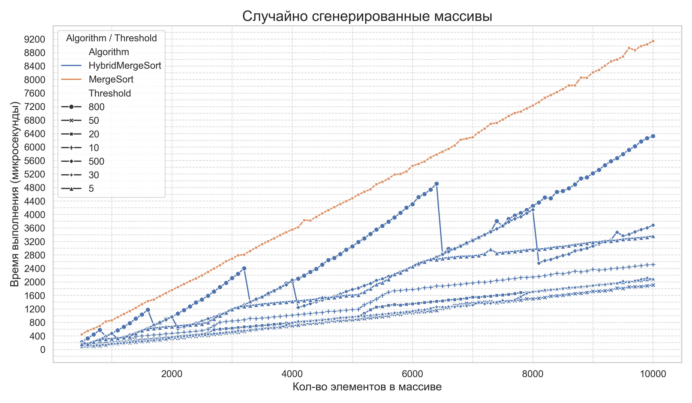
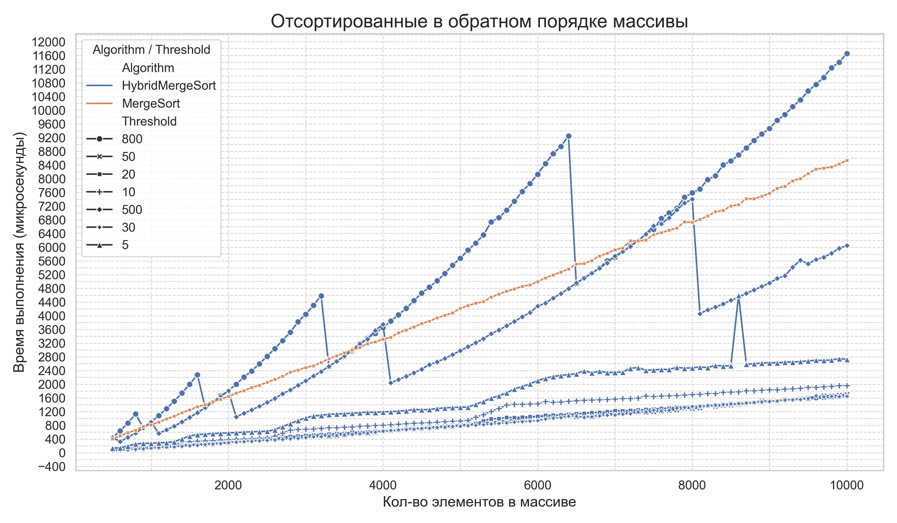
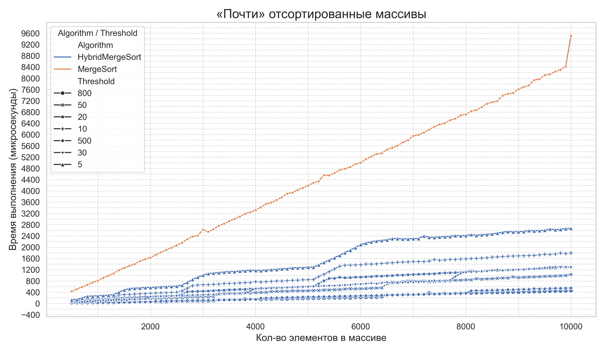
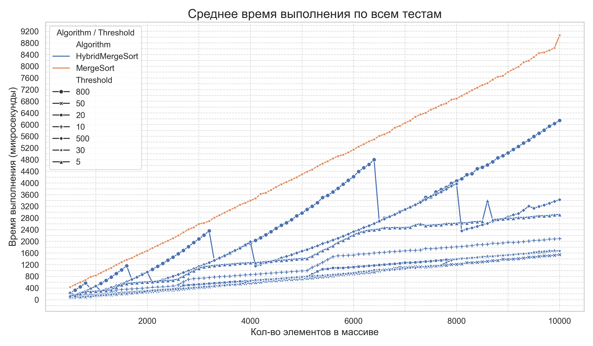

# SET-3. Аналитика.
Выполнил: Юнда Степан Владимирович, БПИ 235

## Задача А2. Анализ MERGE+INSERTION SORT.

ID посылку A1i в CodeForces: `293130640`
Ссылка на публичный репозиторий: https://github.com/MrStepWay/DSA_SET3_A2

## Анализ

В результате выполнения программы `src/A2.cpp` были получены данные, которые расположены в папке `data`, по ним были построены графики, которые расположены в папке `images`.

Из этих графиков очевидно, что гибридная реализация работает быстрее, чем обычная реализация Merge Sort. Особенно эффективно себя показывает в случаях, когда массив почти отсортирован (оно и логично из реализации Insertion Sort). В таком случае чем больше threshold, тем лучше (из рассмотренных, при threshold равном 800 алгоритм работает быстрее всего, примерно в 22 раза быстрее при кол-ве элементов, приближающемся к 10000!).

В случае с массивами, отсортированными в обратном порядке, уже при threshold равном 500 алгоритм иногда работает хуже, чем Merge Sort, в при threshold равном 800 почти всегда хуже (на рассмотренном количестве элементов). Тем не менее, при threshold равном 20, 30 и 50 алгоритмы работают примерно одинаково.

В среднем, гибридная реализация работает эффективнее и тем эффективнее, чем больше элементов в массиве.

Стоит отметить, что гибридную реализацию следует использовать, если данные частично отсортированы, так же это стоит учитывать при выборе threshold.